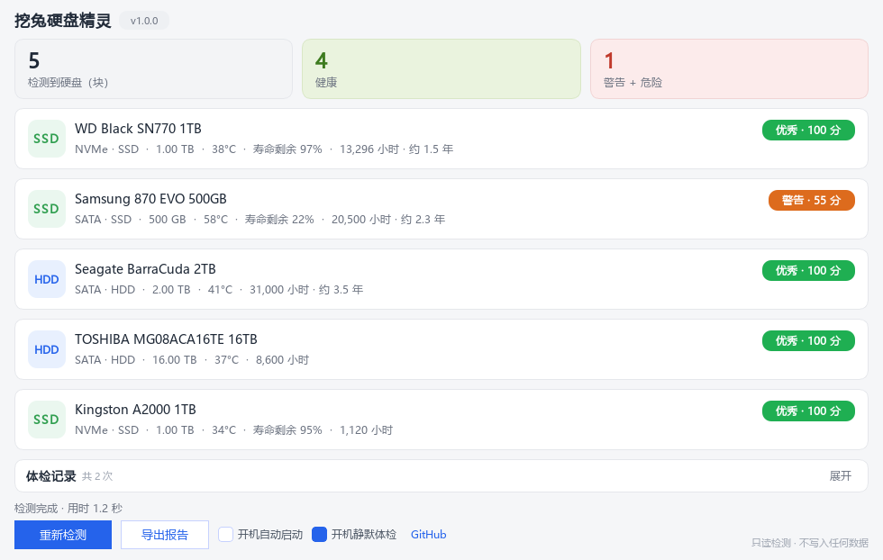

# 挖兔硬盘精灵 (WatuDiskSprite)

> 挖兔品牌系列工具 · 硬盘健康守护
> 免安装 · 不联网 · 只读检测 · 单文件绿色版

[](LICENSE)
[](https://www.microsoft.com/windows)
[](https://github.com/fan138/WatuDisk/releases)
[](https://www.python.org)
[-purple)](https://doc.qt.io/qtforpython/)



## 软件简介

**挖兔硬盘精灵**是一款 Windows 硬盘健康检测与守护工具。在频繁读写、长时间高负载运行的时代，它像一位安静的守夜人：开机静默体检、闲时自动巡检、健康变色托盘、有温度的提醒，把「坏了才发现」变成「早有预备」。

- 单文件绿色版，双击即跑，不写注册表、不留垃圾；
- 全程离线运行，不联网、不收集任何数据；
- 只读检测，绝不向硬盘写入任何数据；
- 适配 SATA / NVMe（含国产主控固件），管理员权限下读取完整 SMART 信息。

## ✨ 功能特性

- **智能体检**：SMART 属性解析（SATA）、NVMe 健康日志直读（含国产主控固件兼容）、可靠性计数器、系统事件日志归因、卷损坏位检查
- **综合评分**：六档颜色（优秀 / 良好 / 注意 / 警告 / 危险 / 紧急），所有指标异常自动变色警示，可一键忽略
- **专业指标**：通电时间、通电次数、累计写入 / 读取量、剩余寿命、可用备用空间、不安全断电、媒体错误……对齐专业检测软件
- **360 式体检过程**：7 步逐项打勾动效，检测中硬盘卡片即时出现，评分 0→满分数值滚动
- **托盘常驻**：图标随健康档位变色，体检时绿点呼吸；悬停显示开机时长
- **自绘气泡提醒**：200+ 条诗情画意文案，不受 Windows 勿扰模式影响；五种提醒方案可选
- **关机 / 重启守护**：关机前毫秒级只读复查，异常下次开机郑重提醒
- **体检记录**：健康痕迹本地留档（封顶 200 条自动淘汰），支持折叠与逐盘详情

## 🖥️ 主界面

顶部为软件名与版本徽章；中间是「检测到硬盘 / 健康 / 警告 + 危险」三宫格概览与逐盘卡片（点击展开专业指标网格、SMART 明细、事件摘要与建议）；底部是 7 步体检进度与「开始全盘检测 / 导出报告 / 开机自动启动 / 开机静默体检」开关，以及 GitHub 链接。

## 🔒 隐私与安全承诺

- **全程离线**：无任何网络请求（源码中零网络模块导入）
- **只读检测**：绝不写入硬盘数据，唯一落盘是本地记录文件（几十 KB）
- **绿色免安装**：不写注册表、无残留垃圾；开机启动用「启动文件夹快捷方式」实现
- 开机启动 / 定时自检均在系统空闲时进行，不与你的工作抢资源

## 📦 下载与运行

从 [Releases](https://github.com/fan138/WatuDisk/releases) 下载 `WatuDiskSprite.exe`，双击即可运行，无需安装。

- 读取完整 SMART 数据需要管理员权限（程序会自动请求 UAC 提权）；
- 若未以管理员身份运行，部分检测项会受限，界面会明确提示。

## 📋 使用说明

- **开始检测**：打开软件即自动全盘体检；也可点「开始全盘检测」手动重测。
- **托盘常驻**：关闭主窗口会最小化到托盘（右下角图标）；右键托盘可立即检测、查看提醒设置、退出。
- **开机自启**：勾选「开机自动启动」；「开机静默体检」会在系统空闲后自动体检一次并记录，有问题才弹提醒。
- **导出报告**：检测完成后点「导出报告」可保存为本地 HTML 报告。
- **忽略项**：某指标异常但你知道无碍，可点该项「忽略」——只影响显示，评分始终保持真实。

## 🛠️ 环境要求

- Windows 10 / 11（x64）
- 读取完整 SMART 数据需要管理员权限

## 📁 目录结构

```
├── src/
│   ├── main.py              # 程序入口（提权 / 单实例 / 自检 / 冒烟）
│   ├── core/                # 检测与逻辑核心（零第三方依赖）
│   │   ├── disk_info.py     #   磁盘枚举与可靠性计数器
│   │   ├── nvme_health.py   #   NVMe 健康日志直读（ctypes IOCTL）
│   │   ├── smart_parser.py  #   SATA SMART 属性解析
│   │   ├── event_scan.py    #   系统事件日志扫描与归因
│   │   ├── volume_check.py  #   卷损坏位 + 剩余空间
│   │   ├── verdict.py       #   评分引擎与六档等级
│   │   ├── metrics.py       #   指标阈值与四色警示
│   │   ├── tender.py        #   200+ 条温度提醒文案库
│   │   ├── notify_policy.py #   五种提醒方案与习惯降噪
│   │   ├── autostart.py     #   开机启动（启动文件夹，绿色方式）
│   │   ├── shutdown_guard.py#   关机/重启守护
│   │   └── store.py         #   有界本地存储（自动迁移）
│   ├── ui/                  # PySide6 界面（主窗 / 托盘 / 自绘气泡）
│   ├── assets/              # 图标资源
│   └── build/               # PyInstaller 打包配置
└── test/                    # 自动化回归测试
```

## 🔧 构建方法

```powershell
# 1. 安装依赖（Python 3.13 + PySide6）
pip install PySide6

# 2. 运行源码
python src/main.py

# 3. 运行自检
python src/main.py --selftest

# 4. 打包单文件 exe
python -m PyInstaller --clean --noconfirm `
  --distpath deploy --workpath build/pyinstaller `
  src/build/diskguard.spec
```

## 📄 许可证

[GPL-3.0](LICENSE)（双许可）—— 本软件自由开源：可自由使用、学习、修改与分发，衍生作品同样须以 GPL-3.0 开源并保留原作者署名；如需闭源或排除 GPL 条款的商业授权，请与作者联系。

## 🙏 鸣谢

- [PySide6 (Qt)](https://www.qt.io/) 界面框架
- 所有在硬盘健康领域持续输出知识的社区与厂商文档

---
*挖兔出品 · 挖兔下载器的兄弟产品 · 用心守护每一块硬盘*
