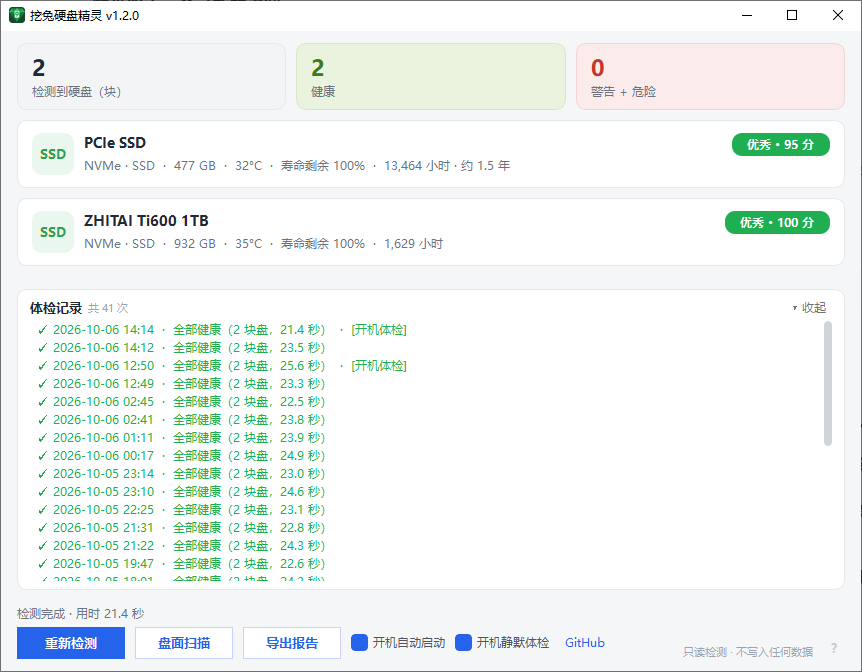
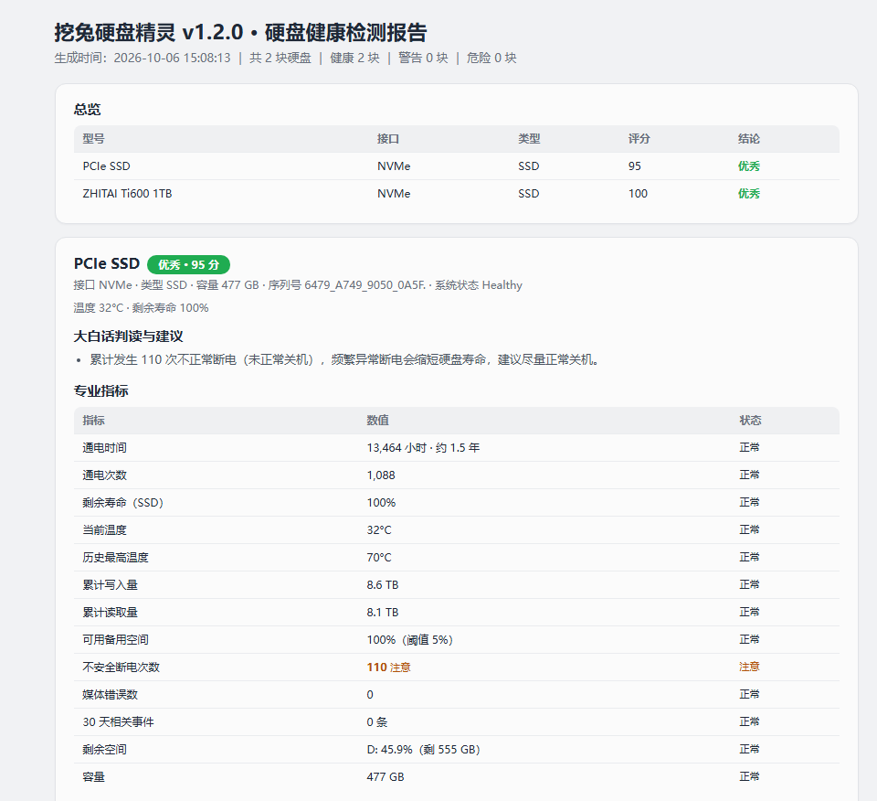
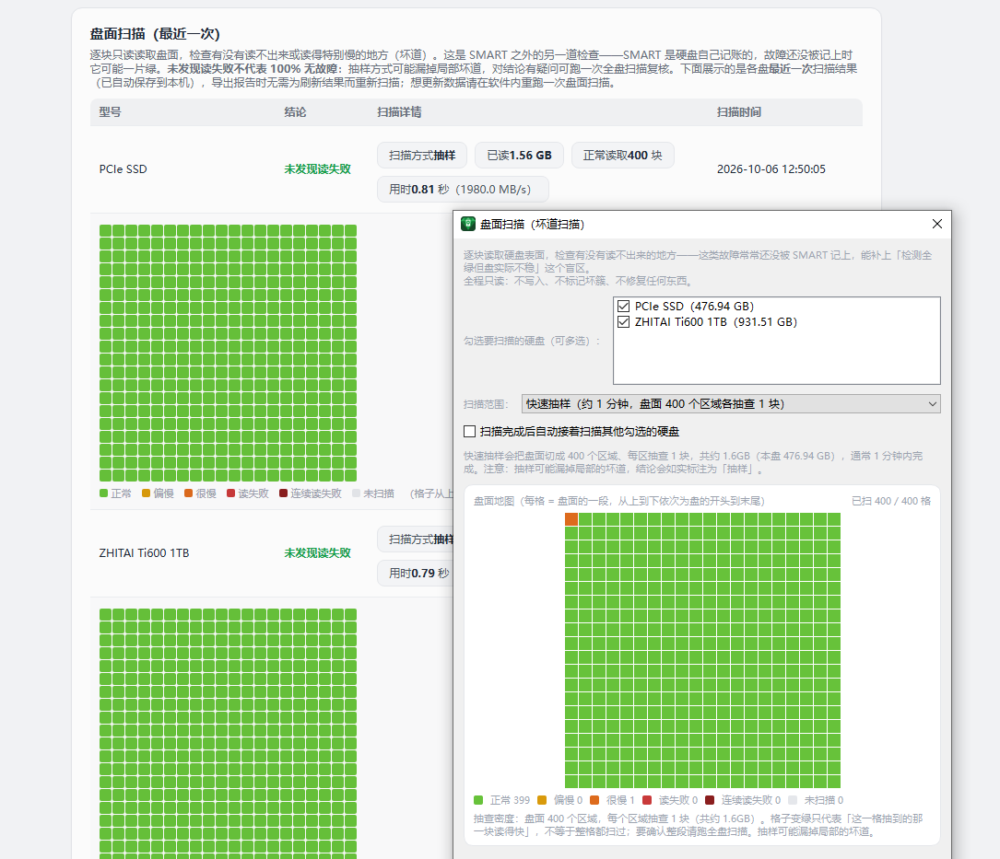

# 挖兔硬盘精灵 (WatuDiskSprite)

> 挖兔品牌系列工具 · 硬盘健康守护
> 免安装 · 不联网 · 只读检测 · 单文件绿色版
>
> **WatuDiskSprite** — a free, offline, read-only Windows disk-health guardian: SATA/NVMe SMART, six-tier color alerts, silent boot-time scan, and one-click HTML report.

[](LICENSE)
[](https://www.microsoft.com/windows)
[](https://github.com/fan138/WatuDisk/releases)
[](https://www.python.org)
[-purple)](https://doc.qt.io/qtforpython/)
[](https://github.com/fan138/WatuDisk/releases)
[](https://github.com/fan138/WatuDisk/releases)
[](https://github.com/fan138/WatuDisk/stargazers)
[](https://gitee.com/fan188/WatuDisk)



## 软件简介

**挖兔硬盘精灵**是一款 Windows 硬盘健康检测与守护工具。在频繁读写、长时间高负载运行的时代，它像一位安静的守夜人：开机静默体检、闲时自动巡检、健康变色托盘、有温度的提醒，把「坏了才发现」变成「早有预备」。

- 单文件绿色版，双击即跑，不写注册表、不留垃圾；
- 全程离线运行，不联网、不收集任何数据；
- 只读检测，绝不向硬盘写入任何数据；
- 适配 SATA / NVMe（含国产主控固件），管理员权限下读取完整 SMART 信息。

## ✨ 功能特性

- **智能体检**：SMART 属性解析（SATA）、NVMe 健康日志直读（含国产主控固件兼容）、可靠性计数器、系统事件日志归因、卷损坏位检查
- **盘面扫描（v1.2 新增）**：逐块只读读盘面找坏道，20×20 热力图把「读不出来」和「读得特别慢」的区域标在盘的具体位置上
- **综合评分**：六档颜色（优秀 / 良好 / 注意 / 警告 / 危险 / 紧急），所有指标异常自动变色警示，可一键忽略
- **专业指标**：通电时间、通电次数、累计写入 / 读取量、剩余寿命、可用备用空间、不安全断电、媒体错误……对齐专业检测软件
- **360 式体检过程**：7 步逐项打勾动效，检测中硬盘卡片即时出现，评分 0→满分数值滚动
- **托盘常驻**：图标随健康档位变色，体检时绿点呼吸；悬停显示开机时长
- **自绘气泡提醒**：200+ 条诗情画意文案，不受 Windows 勿扰模式影响；五种提醒方案可选
- **关机 / 重启守护**：关机前毫秒级只读复查，异常下次开机郑重提醒
- **体检记录**：健康痕迹本地留档（封顶 200 条自动淘汰），支持折叠与逐盘详情

## 🖥️ 主界面

顶部为软件名与版本徽章；中间是「检测到硬盘 / 健康 / 警告 + 危险」三宫格概览与逐盘卡片（点击展开专业指标网格、SMART 明细、事件摘要与建议）；底部是 7 步体检进度与「开始全盘检测 / 盘面扫描 / 导出报告 / 开机自动启动 / 开机静默体检」开关，以及 GitHub 链接。

## 🧾 体检报告示例

检测完成后点「导出报告」，一键生成完整本地 HTML 报告（可直接浏览器打开、留存或分享）：



## 🗺️ 盘面扫描示例（v1.2 新增）

点「盘面扫描」→ 勾选要扫的硬盘（可多选）→ 选扫描范围 → 开始。扫描中盘面地图会「扫一块亮一块」，跑完这块盘就换成下一块。窗口可以最小化到后台继续扫，主界面那个按钮会实时显示进度。



两档可选：

- **快速抽样**（约 1 分钟）：盘面切成 400 个区域，每区抽 1 块读一遍。适合日常体检后顺手查一次。
- **全盘逐块**（机械盘可能几小时）：400 个区域全部逐块读完，格子颜色代表整段情况。怀疑盘有问题时才用。

结果会自动存到本地，导出报告时一起带上，不用为了出报告再扫一遍。

## 🔒 隐私与安全承诺

- **全程离线**：无任何网络请求（源码中零网络模块导入）
- **只读检测**：绝不写入硬盘数据，唯一落盘是本地记录文件（几十 KB）
- **绿色免安装**：不写注册表、无残留垃圾；开机启动用「启动文件夹快捷方式」实现
- 开机启动 / 定时自检均在系统空闲时进行，不与你的工作抢资源

## 📦 下载与运行

从下方任一渠道下载 `WatuDiskSpriteV1.2.1.zip`（内含 `WatuDiskSprite.exe` 单文件绿色版），解压后双击 `WatuDiskSprite.exe` 即可运行，无需安装。

| 下载源 | 说明 |
| --- | --- |
| **[GitHub Releases](https://github.com/fan138/WatuDisk/releases)** | 主站，全球可用 |
| **[Gitee 附件·国内直下](https://gitee.com/fan188/WatuDisk/releases)** | 国内镜像，直链最快 |
| **[蓝奏云](https://wwata.lanzouv.com/i2i8j4akun9c)** | 国内备用，免登录 |
| **[百度网盘](https://pan.baidu.com/s/1tdQv-ES-FKT285VQstu2Lg?pwd=1234)** | 提取码 `1234`，长期备份 |

- 读取完整 SMART 数据需要管理员权限（程序会自动请求 UAC 提权）；
- 若未以管理员身份运行，部分检测项会受限，界面会明确提示。

## 📝 v1.2.1 更新了什么

这一版都在收拾界面上的琐碎，让软件更好懂、更好用。

**使用说明重写了**：以前打开「?」是一堆答疑式的解释，现在改成按用户视角讲清楚——**这是什么软件、能帮你解决什么问题、有哪些功能、为什么放心用**。第一次打开的人几十秒就能看懂。

**体检记录变得干净了**：原来每行一个「✕」、还有个突兀的「清空」按钮；现在折叠时底部操作区完全不显示，展开只有一个垃圾桶小图标，点它才出现复选框，**勾中记录后才出现「删除」**。不勾就看不到，界面始终清爽。

**其它改动**

- 开机启动开关不再卡顿 —— 原先点一下要等约 1 秒才知道结果（写快捷方式走的是 COM 调用），现在挪到后台线程，点下去即时响应；
- 修复「首次打开时勾选了开机启动，但系统启动列表里看不到」——补齐了写入失败时的重试与回查；
- 主界面按钮更紧凑，宽胖的药丸按钮收窄了一圈；
- 修复一个版本 exe 启动即报错的问题（打包时漏了图标渲染模块）。

## 📝 v1.2.0 更新了什么

这一版的重点是**补上一个大盲区**：SMART 全绿，不代表盘没坏。有些盘在彻底坏掉之前，SMART 里根本记不上，但读起来已经明显变慢、或者某些区域直接读不出来。v1.2 之前查不出这种问题，现在补上了。

**新增：盘面扫描（坏道检测）**

- 逐块只读读盘面，两档：快速抽样（约 1 分钟）/ 全盘逐块（机械盘可能几小时）；
- 20×20 盘面热力图，400 格**扫到哪亮到哪**，坏块和「读得特别慢」的区域都标在盘的具体位置上；
- 坏道在彻底读不出来之前，通常先表现为明显变慢——这个「提前量」是它最有价值的地方；
- 全部只读，不写盘、不标记坏簇、不调用 `chkdsk`；
- 多盘可以勾选着连着扫，扫完自动接下一块；窗口能收进后台跑，主界面按钮实时显示进度。

**修掉的问题**

- 找了两块盘却只显示一块 —— 磁盘枚举加了双通道兜底，现在不会漏盘了；
- 早期 SSD 被误报「寿命 0%」—— 那种盘压根不上报寿命，不该按坏了算；
- 开机问候语串味 —— 下午两点说「夜深了」，时段判断精确到小时；
- 体检记录面板挡住展开的磁盘详情 —— 展开卡片时自动收起；
- 报告页脚给的反馈地址是仓库首页，等于没接住反馈，已改到 Issues 页。

**其它**

- 「评分说明」并入右下角「?」，底部按钮少一个；
- 健康分口径写清楚了：为什么我给 92 分、某软件给 78 分——底层读数一样，算法各家自己定，分数不完全一致是正常的；
- 体检记录现在存 200 条（以前 30 条），并把 30 天前的自动折叠起来。

## 🚀 接下来（v1.3 计划）

按现在收到的反馈呼声排的，大致是这个顺序：

- **邮件 / 微信提醒**：状态变化才推，不刷屏——硬盘突然报异常时你在上班，得让你知道；
- **USB 移动固态识别**：不少移动固态通过 USB 桥接，SMART 读不到，v1.2 里只能如实标注「不支持」；
- **Intel VMD / 服务器 RAID 支持**：RAID 卡后面的物理盘在 Windows 层看不见，得走控制器专用解析；
- **SAS 企业盘支持**；
- **NVMe 主控与固件信息**、温度口径细化。

进度会开 Issue 跟踪，也欢迎在 Issues 里提需求、报误报。

## 📋 使用说明

- **开始检测**：打开软件即自动全盘体检；也可点「开始全盘检测」手动重测。
- **盘面扫描**：点「盘面扫描」→ 勾选要扫的硬盘（可多选）→ 选扫描范围（快速抽样 / 全盘逐块）→ 开始扫描。扫描中可以点「隐藏」收进后台继续跑，主界面按钮会实时显示进度；扫完点按钮看结果。
- **托盘常驻**：关闭主窗口会最小化到托盘（右下角图标）；右键托盘可立即检测、查看提醒设置、退出。
- **开机自启**：勾选「开机自动启动」；「开机静默体检」会在系统空闲后自动体检一次并记录，有问题才弹提醒。
- **导出报告**：检测完成后点「导出报告」可保存为本地 HTML 报告，报告里会带上最近的盘面扫描结果。
- **忽略项**：某指标异常但你知道无碍，可点该项「忽略」——只影响显示，评分始终保持真实。

## 🛠️ 环境要求

- Windows 10 / 11（x64）
- 读取完整 SMART 数据需要管理员权限

## 📁 目录结构

```
├── src/
│   ├── main.py              # 程序入口（提权 / 单实例 / 自检 / 冒烟）
│   ├── core/                # 检测与逻辑核心（零第三方依赖）
│   │   ├── disk_info.py     #   磁盘枚举与可靠性计数器
│   │   ├── nvme_health.py   #   NVMe 健康日志直读（ctypes IOCTL）
│   │   ├── smart_parser.py  #   SATA SMART 属性解析
│   │   ├── surface_scan.py  #   盘面扫描（只读坏道检测 + 400 格分区）
│   │   ├── event_scan.py    #   系统事件日志扫描与归因
│   │   ├── volume_check.py  #   卷损坏位 + 剩余空间
│   │   ├── verdict.py       #   评分引擎与六档等级
│   │   ├── metrics.py       #   指标阈值与四色警示
│   │   ├── tender.py        #   200+ 条温度提醒文案库
│   │   ├── notify_policy.py #   五种提醒方案与习惯降噪
│   │   ├── autostart.py     #   开机启动（启动文件夹，绿色方式）
│   │   ├── shutdown_guard.py#   关机/重启守护
│   │   └── store.py         #   有界本地存储（自动迁移）
│   ├── ui/                  # PySide6 界面（主窗 / 托盘 / 自绘气泡 / 盘面扫描）
│   ├── assets/              # 图标资源
│   └── build/               # PyInstaller 打包配置
└── test/                    # 自动化回归测试
```

## 🔧 构建方法

```powershell
# 1. 安装依赖（Python 3.13 + PySide6）
pip install PySide6

# 2. 运行源码
python src/main.py

# 3. 运行自检
python src/main.py --selftest

# 4. 打包单文件 exe
python -m PyInstaller --clean --noconfirm `
  --distpath deploy --workpath build/pyinstaller `
  src/build/diskguard.spec
```

## 💬 反馈与共建

- 遇到问题、想要新功能、或发现误报？请到 [Issues](https://github.com/fan138/WatuDisk/issues) 留言；也欢迎在 [Gitee 镜像](https://gitee.com/fan188/WatuDisk) 提，国内访问更顺。
- 这是一个自由开源（GPL-3.0）项目，欢迎 Star、Fork 与 PR；
- 软件完全离线、只读、不收集任何数据，可放心使用。

## 📄 许可证

[GPL-3.0](LICENSE)（双许可）—— 本软件自由开源：可自由使用、学习、修改与分发，衍生作品同样须以 GPL-3.0 开源并保留原作者署名；如需闭源或排除 GPL 条款的商业授权，请与作者联系。

## 🙏 鸣谢

- [PySide6 (Qt)](https://www.qt.io/) 界面框架
- 每一位在 Issues 里提过问题、报过误报、留下实测数据的坛友——v1.2 这一版的 15 条改进，绝大多数是被你们逼出来的
- 所有在硬盘健康领域持续输出知识的社区与厂商文档

---
*挖兔出品 · 挖兔下载器的兄弟产品 · 用心守护每一块硬盘*
